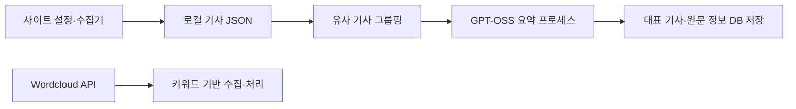

# 🤖 Briefit AI Repository

여러 국내외 뉴스 사이트의 기사를 수집하고, 유사한 기사를 묶어 핵심 내용을 요약하는 뉴스 큐레이션 서비스의 AI 저장소입니다. 다양한 관점을 비교하고 중립적인 표현으로 요약하는 것을 목표로 합니다. 편향 제거·사실 정확성의 달성을 검증한 품질 수치는 이 문서에서 주장하지 않습니다.

[팀·서비스 소개](https://github.com/capstone-btd/.github/blob/main/profile/README.md) · [프론트엔드](https://github.com/capstone-btd/Briefit_FE) · [백엔드](https://github.com/capstone-btd/Briefit_BE) · [2025 KoBART 구현 상세](docs/2025-kobart-implementation.md)

## 주요 기능과 현재 구성

- **다중 소스 수집**: 사이트 설정과 수집기별 로직으로 기사 본문을 가져옵니다.
- **유사 기사 그룹핑**: 관련 기사를 묶고 대표 기사와 원문 정보를 구성합니다.
- **요약·재작성**: 현재 전체 파이프라인은 GPT-OSS 요약 스크립트를 별도 프로세스로 호출합니다. 객관적 표현과 핵심 정보 보존은 생성 프롬프트의 요구 사항입니다.
- **이슈 키워드 경로**: Wordcloud API와 키워드 기반 수집·처리 경로가 별도로 있습니다.



현재 경로는 [`run_full_pipeline.py`](Article_Collector/run_full_pipeline.py) → [`run_processing2.py`](Article_Collector/scripts/run_processing2.py) → [`run_summarization_by_gpt.py`](Article_Collector/scripts/run_summarization_by_gpt.py)입니다. 기존 `KoBARTSummarizer`와 Gemini 클래스가 [`summarizer.py`](Article_Collector/src/processing/summarizer.py)에 남아 있지만, 현재 전체 파이프라인의 실제 호출 경로와 구분해야 합니다.

2025.05–09 프로젝트에서 6인 팀 중 AI 담당 2인에 참여했습니다. 아래 내용은 공세민의 2025년 수집·KoBART 작업이며, 현재 팀의 GPT-OSS 경로 전체를 개인 구현으로 설명하지 않습니다.

| 담당 범위 | 구현과 판단 | 근거 |
| --- | --- | --- |
| 기사 수집·정제 | 기사 URL 필터, 본문 선택자, 불필요 태그 제거, 짧은 본문 제외, 성공적으로 저장한 URL을 실행 내 배치끼리 공유 | [수집 변경](https://github.com/capstone-btd/Briefit_AI/commit/a7b25dff1438940fea631d8ba597835435b7c32a) |
| 학습 입력·평가 | 기사와 기준 요약을 JSONL로 분리하고 KoBART 입력·정답을 각각 토큰화, 학습·생성·ROUGE 스크립트 구성 | [KoBART 변경](https://github.com/capstone-btd/Briefit_AI/commit/714502c017f0c57ebebd634b60ea77a102945d81) |
| 긴 기사·출력 정리 | 문단을 묶어 부분 요약 후 재요약, 생성문 끝의 반복·짧은 문장을 별도 함수로 제거 | [후처리 변경](https://github.com/capstone-btd/Briefit_AI/commit/da4ea1b09cfd44724facc19233d65c07e4301f3a) |

수집, 모델 생성, 후처리를 나눠 중복 입력·문맥 잘림·출력 반복을 각 단계에서 확인하도록 구성했습니다. URL 집합은 실행이 끝나면 사라지고, 긴 입력 분할도 모든 문맥의 보존을 보장하지 않습니다. 정상적인 짧은 문장을 삭제할 수 있는 후처리의 조건, 학습·서비스 생성·평가 길이 차이와 원리 도식은 [구현 상세](docs/2025-kobart-implementation.md)에 정리했습니다.

## 팀 프로젝트 수상

- 2025 IT대학 소프트웨어 공모전 금상 — 2025.08.18
- 제15회 숭실 캡스톤디자인 경진대회 장려상 — 2025.10.01
- 2025 IT 프로젝트 프로리그 장려상 — 2025.11.22

[수상 증빙·포트폴리오](https://seminkong.github.io/SeMinKong_Web/resume/)

## 기술 스택

| 영역 | 구성 |
| --- | --- |
| 언어·API | Python, FastAPI, Uvicorn |
| 수집·전처리 | aiohttp, BeautifulSoup, lxml, Playwright/Crawl4AI, PyYAML, 한국어 NLP 도구 |
| 현재 요약 경로 | PyTorch, Transformers, GPT-OSS |
| 2025 KoBART 작업 | Transformers, Datasets, Evaluate/ROUGE, KoBART |
| 저장 | SQLAlchemy, MySQL 연결 |

## 실행 방법

현재 소스의 진입점과 경로를 기준으로 한 안내입니다. 이번 문서 정리에서는 수집·DB 쓰기·모델 다운로드·학습을 실행하지 않았습니다. 외부 사이트 구조와 모델·패키지 호환성은 실행 환경에서 확인해야 합니다.

### 1. 환경 설정

```bash
git clone https://github.com/capstone-btd/Briefit_AI.git
cd Briefit_AI
conda create -n briefit python=3.10.16
conda activate briefit
python -m pip install -r Article_Collector/requirements.txt
python -m pip install -r Wordcloud_API/requirements.txt
```

기존 로컬 안내는 Python 3.10.16, 수집기 Dockerfile은 Python 3.11을 사용합니다. 통일된 잠금 파일은 없습니다. `Article_Collector/requirements.txt`의 PyTorch 설치 줄은 주석 처리되어 있으므로 환경에 맞는 PyTorch 설치가 별도로 필요합니다. 브라우저 실행 환경, MeCab-ko와 DB 연결도 준비해야 합니다. 수집기 코드는 MeCab 경로를, GPT-OSS 코드는 모델 캐시 경로를 특정 머신 경로로 설정하므로 실행 전에 자신의 경로로 조정해야 합니다. 설정 값은 로컬 환경으로 관리합니다.

### 2. 두 실행 경로

저장소 루트에서 일반 기사 수집·요약을 실행합니다.

```bash
cd Article_Collector
python run_full_pipeline.py
```

Wordcloud 경로는 별도 터미널에서 API를 실행한 뒤, 또 다른 터미널에서 수집기를 실행합니다. 아래 각 블록은 저장소 루트에서 시작합니다.

```bash
cd Wordcloud_API
uvicorn main:app --reload
```

```bash
cd Article_Collector
python run_wc_pipeline.py
```

2025년 `Kobart/`·`Dataset/` 파일은 현재 `main` 트리에 없으므로 위 명령과 섞지 않습니다. 과거 소스의 고정 링크와 재현 전 확인 사항은 [2025 구현 상세](docs/2025-kobart-implementation.md#재현과평가조건)에 있습니다.

## 검증 범위

현재 코드와 2025년 기여 커밋을 대조했습니다. 공개된 학습 완료 로그, 해당 체크포인트와 연결된 ROUGE 결과, 후처리 전후의 품질 비교는 확인하지 못했습니다. 현재 GPT-OSS 경로에서도 중립성 프롬프트가 편향 제거 또는 사실 보존을 증명하지는 않습니다.

## 기여 방법

이슈로 재현 조건과 제안을 공유하거나 Pull Request로 변경 사항을 제안할 수 있습니다.

## 라이선스

기존 README는 MIT 라이선스로 안내했으나, 확인한 `main` 트리에는 `LICENSE` 파일이 없습니다. 정확한 이용 조건은 프로젝트 관리자에게 확인해야 합니다.

문서 기준: 현재 `main` [`35f3a19`](https://github.com/capstone-btd/Briefit_AI/tree/35f3a19a0481bdef8a06830ecd134d072ac6bf01), 소스 대조 2026-09-12.
