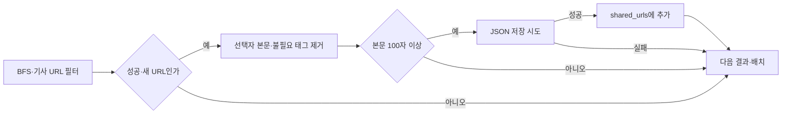
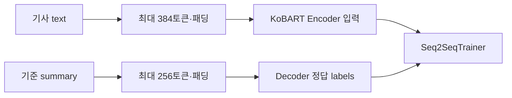
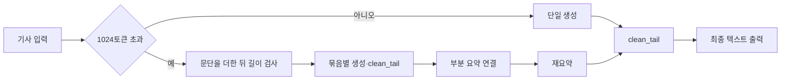

# 2025 기사 수집·KoBART 구현 상세

[README로 돌아가기](../README.md)

## 소스와 담당 범위

| 소스 | 개인 구현 내용 |
| --- | --- |
| [수집 `a7b25df`](https://github.com/capstone-btd/Briefit_AI/blob/a7b25dff1438940fea631d8ba597835435b7c32a/Dataset/Crawl4AI.py) | Crawl4AI 탐색·URL 필터·본문 정제·실행 내 중복 저장 방지 |
| [학습 `714502c`](https://github.com/capstone-btd/Briefit_AI/blob/714502c017f0c57ebebd634b60ea77a102945d81/Kobart/Scripts/Train.py) | 입력/정답 토큰화, Seq2SeqTrainer 설정 |
| [데이터 분할 `714502c`](https://github.com/capstone-btd/Briefit_AI/blob/714502c017f0c57ebebd634b60ea77a102945d81/Kobart/Scripts/Prepare_Dataset.py) | seed를 정한 shuffle과 train/valid/test JSONL 작성 |
| [생성·후처리 `da4ea1b`](https://github.com/capstone-btd/Briefit_AI/blob/da4ea1b09cfd44724facc19233d65c07e4301f3a/Kobart/Scripts/GenerateJson.py) | 긴 기사 부분 요약·재요약, `_clean_tail` |
| [평가 `714502c`](https://github.com/capstone-btd/Briefit_AI/blob/714502c017f0c57ebebd634b60ea77a102945d81/Kobart/Scripts/Evaluate.py) | test 기사 원문으로 생성한 텍스트와 기준 요약의 ROUGE 비교 |

## 수집과 중복 저장 방지

네이버 뉴스 시드에서 BFS 탐색을 수행하며 기사 URL을 허용하고 댓글 URL을 제외합니다. 성공한 페이지 중 본문 선택자가 찾은 첫 요소에서 `script`, `style`, `noscript`, `iframe`을 제거하고, 정리된 본문이 100자보다 짧으면 저장하지 않습니다.

한 배치는 목표 10건, 전체 목표는 5,000건으로 설정되어 있습니다. 이는 **설정된 목표량**이며 실제 수집 실적이 아닙니다. 배치들을 순차 실행할 때 같은 `shared_urls` 집합을 전달하고 **파일 저장에 성공한 뒤** URL을 추가합니다. 실패한 저장이 성공 이력에 포함되는 것을 피하고, 다음 배치에서 이미 저장한 동일 URL을 건너뜁니다.

집합은 프로세스 메모리에만 있으므로 다시 실행하면 이전 URL 이력은 복원하지 않습니다. URL 문자열 비교는 본문 유사도·동일 사건 중복 제거와도 다릅니다. 저장 JSON에는 `content`만 들어가며, 별도의 생성 스크립트는 `body`를 읽습니다. 수집 결과가 필드 변환 없이 곧바로 서비스 모델·DB까지 연결된다고 설명하지 않습니다.

## 기사와 기준 요약을 서로 다른 학습 입력으로

원본 `articles` 배열의 `content`·`summary`를 정리한 뒤 기본 seed 42로 섞습니다. 기본 분할은 0.8/0.1/0.1이고, 앞의 두 경계는 정수로 내림하며 나머지가 test가 됩니다. 이는 기사 단위 무작위 분할이며, 같은 사건이나 유사 기사를 한 묶음으로 분리하는 로직은 없습니다.

사전학습 모델은 `gogamza/kobart-base-v2`입니다. `preprocess_fn`은 `text`를 `input_ids`·`attention_mask`로, `summary`를 `labels`로 전달합니다. 기사와 정답을 동일 입력 문자열로 합치지 않습니다. 소스에서는 정답 패딩 ID를 그대로 `labels`에 넣고 있으며 별도로 `-100`으로 치환하는 처리는 없습니다.

기본 학습 설정은 5 epochs, 장치별 batch 4, gradient accumulation 4, learning rate `3e-5`, warmup 500입니다. 생성 평가 관련 설정은 beam 4, 최대 길이 256, 선택 지표 `rouge2`입니다. 이 설정과 코드 존재를 학습 완료나 성능 향상의 근거로 삼지는 않습니다.

## 긴 기사는 부분 요약한 뒤 재요약

생성 시에는 정답 요약 없이 기사만 입력합니다. beam search는 4개 후보 경로를 사용하며 `length_penalty=1.2`가 설정되어 있습니다.

| 생성 경로 | 입력 제한 | 출력 `max_length` | 처리 |
| --- | --- | --- | --- |
| 입력 토큰 수 ≤ 1024 | 1024 | 1024 | 한 번 생성·후처리 |
| 입력 토큰 수 > 1024 | 각 생성에서 1024 | 부분 요약 512 | 문단을 누적해 묶음 생성 |
| 부분 요약들을 연결한 결과 | 1024 | 512 | 연결 텍스트를 재요약·후처리 |

문단을 **추가한 뒤** 1024토큰 초과 여부를 검사하므로, 묶음 자체가 1024보다 길어질 수 있습니다. 매 생성 함수가 입력을 1024에서 자르기 때문에 초과분, 긴 단일 문단, 연결된 재요약 입력이 잘릴 수 있습니다. 소스 주석에 슬라이딩 윈도라고 쓰여 있어도, 구현은 겹치는 창을 이동하는 방식이 아니라 문단을 누적하고 비우는 방식입니다. 전체 문맥을 보존했다고 단정할 수 없습니다.

## 반복 꼬리 후처리와 정보 손실

`_clean_tail`은 문장부호 뒤 공백으로 문장을 나누고, 마지막 문장이 아래 중 하나에 해당하는 동안 제거합니다.

- 앞뒤 공백을 제거한 길이가 8자 미만
- 한글 1~10자 뒤에 `다`와 선택적 문장부호가 오는 정규식에 일치
- 바로 앞 문장과 문자열이 동일

규칙은 최종 요약뿐 아니라 **각 부분 요약에도** 적용됩니다. 문장 끝의 반복 제거를 모델 생성과 분리하여 확인할 수 있지만, 사실을 담은 정상적인 짧은 문장도 지워지거나 전체 출력이 비워질 수 있습니다. 정규식 일치가 의미 중복 판정은 아니므로, 원문 대비 정보 보존과 반복 감소를 함께 평가해야 합니다. 현재 확인된 소스만으로 후처리의 품질 개선율을 제시하지 않습니다.

## 재현과 평가 조건

`Evaluate.py`는 test의 `text`를 최대 1024토큰으로 자르고 beam 4, 출력 상한 128로 생성한 **후처리 전 출력**과 `summary`를 비교합니다. `evaluate.load("rouge")`와 `use_stemmer=True`로 계산한 값을 100배·소수 둘째 자리로 표시합니다. `smart_summarize`·부분 요약·재요약·`_clean_tail`은 이 평가 경로에 없습니다. 따라서 이 스크립트의 점수로 최종 서비스 출력이나 후처리의 효과를 평가했다고 볼 수 없습니다.

| 확인 대상 | 공개 소스에서 확인한 내용 | 남은 조건 |
| --- | --- | --- |
| 파일·작업 경로 | 과거 `Kobart/Scripts`와 `Kobart/Data` | 현재 main에는 없으므로 고정 커밋에서 별도 확인 |
| 모델 파일 | `models/kobart-sum/final`을 읽거나 저장 | 생성에 필요한 실제 체크포인트·토크나이저 확보 |
| 실행 장치 | GenerateJson·Evaluate는 `cuda`, Train은 `fp16=True` | 장치·라이브러리 버전 호환성 검증 |
| 학습 평가 설정 | `load_best_model_at_end=True`, `save_strategy="no"`, `eval_steps=1000` | 저장·평가 전략과 `predict_with_generate` 미설정 등을 해당 Transformers 버전에서 확인 |
| 결과 | 학습·생성·평가 코드와 개인 커밋 | 학습 완료 로그, ROUGE 결과, 체크포인트 연결, 후처리 비교 미확인 |

이 문서의 검증은 원본 코드 대조입니다. 모델 다운로드, 뉴스 요청, 학습, 추론 또는 새 품질 실험은 수행하지 않았습니다. 후속 평가는 원문·기준 요약·raw 출력·최종 출력과 동일 입력 조건을 함께 보존해야 비교할 수 있습니다.
